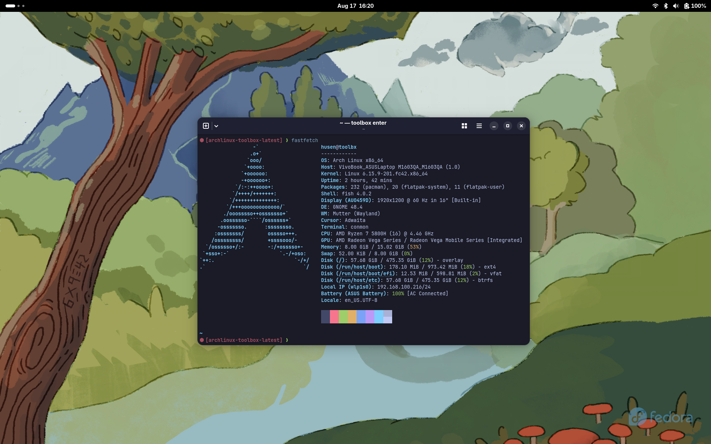

# Arch Linux Toolbox Image




This repository houses a **customized container image for
[toolbox](https://github.com/containers/toolbox)**, built atop **Arch Linux**.
It used as my **default image** for my toolbox-centric workflow, perfectly
crafted for my immutable system setup (see the companion
[lightblue](https://github.com/heyhusen/lightblue) repo).

## Why I create this image?

- **Tailored for Toolbox**  
   Start working faster with `toolbox create` and `toolbox enter` commands,
   without manual setup.

- **Arch Linux Base**  
   Leveraging Arch ensures you get the latest packages with a clean, minimal
   footprint.

- **Ideal for Immutable Systems**  
   Integrates seamlessly into systems where the base OS remains untouched,
   providing containerized flexibility.

## Customizations

Comes preloaded with tools required for my
[dotfiles](https://github.com/heyhusen/dotfiles):

- Shell: Fish
- Editors: Helix & Zed
- Git client: gitui
- Fonts: Noto Sans & JetBrains Mono Nerd Font

I also use this image to create a per-project toolbox image:

```dockerfile
FROM ghcr.io/heyhusen/archlinux-toolbox:latest
...
# Install per-project tools
...
```

**Happy containerizing!**

## License

This project is licensed under the [MIT License](./LICENSE). See the LICENSE
file for details.
